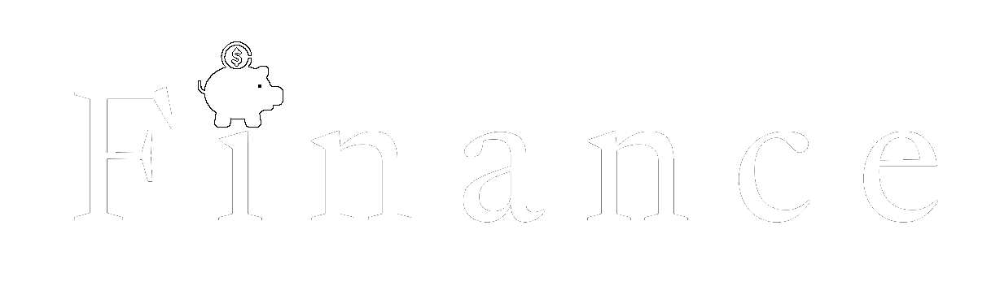
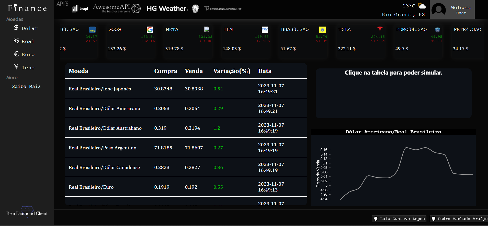

    

**Descrição concisa do projeto**

    Esse é um projeto de aplicativo web criado em Flask, uma estrutura de desenvolvimento em Python, que oferece uma interface para acessar informações financeiras, cotações de moedas, ações e dados meteorológicos com base no IP do usuário. Aqui está uma explicação geral do projeto.

## Funcionalidades

Neste projeto, você encontrará as seguintes funcionalidades:

### 1. Cotações Atualizadas Diariamenes

    Aplicativo criar uma tread para cada atualização de informaçoes, tem 3 treads uma para atualizaçao de moedas, outra pra açoes e a ultima com intuito de montar um grafico.

### 2. Dados de Ações

    O projeto disponibiliza informações detalhadas sobre ações de empresas, permitindo que os usuários acompanhem os valores de mercado e outras informações relacionadas.

### 3. Gráficos Históricos

    Grafico disponibiliza o historico de 15 dias da cotaçoes de Real para Dolar.

### 4. Dados Meteorológicos

    Com base no IP do usuário, o aplicativo obtém informações meteorológicas locais, incluindo clima, cidade e temperatura, oferecendo aos usuários uma visão rápida das condições meteorológicas atuais.

## Atualização Automática de Dados

    O projeto é tem como base manter os dados atualizados automaticamente. Três threads separadas cuidam da atualização de cotações, ações e gráficos em intervalos regulares.

## Dependências

    -Python
    -Flask
    -React
    -HTML CSS JS

## Autores

    Liste os autores ou colaboradores do projeto.

## Exemplo de Tela em execução

    

<!--  

##.\venv\Scripts\Activate.ps1
##Set-ExecutionPolicy -Scope CurrentUser -ExecutionPolicy RemoteSigned

# code (BRL)
# codein (USD)
# name (REAL BRASIELIRO/DOLAR AMERICANO)
# high (VALOR MAIS ALTO ATINGIDO NAS ÚLTIMAS TRANSAÇÕES)
# low (VALOR MAIS ALTO ATINGIDO NAS ÚLTIMAS TRANSAÇOES)
# pctChange (VALOR EM PORCENTAGEM DA VARIAÇÃO EM RELAÇÃO A ÚLTIMA COTAÇAO)
# bid (VALOR DE VENDA NA COTAÇÃO)
# ask (VALOR DE COMPRA NA COTAÇÃO)
# create_date (DATA DA CRIAÇÃO)

# ALPHA KEY KT76MWEQFJZSAT6Z

# NSK8UHCQUQZ8OMMW
# ALPHA KEY NSK8UHCQUQZ8OMMW 
# ALPHA KEY RQWG7IBE5YLW408I EMAIL 2

*** comandos js ***

npm create vite@latest -- criar um novo app
npm install            -- caso não tenha instalado

npm run dev   -rodar apenas o front
npm run build - construir o front obs* apagar a pasta static;
-->